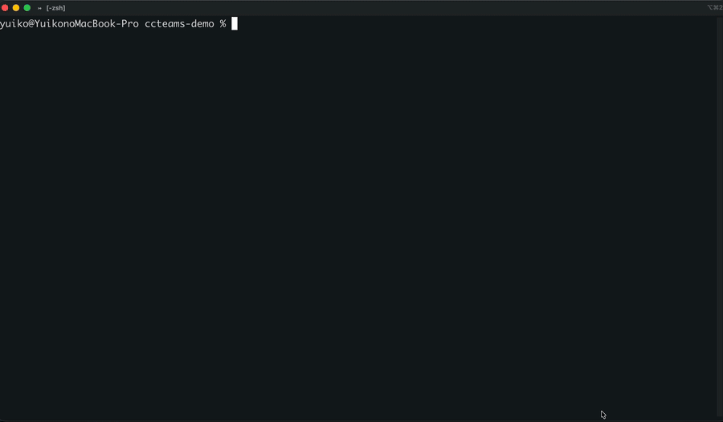
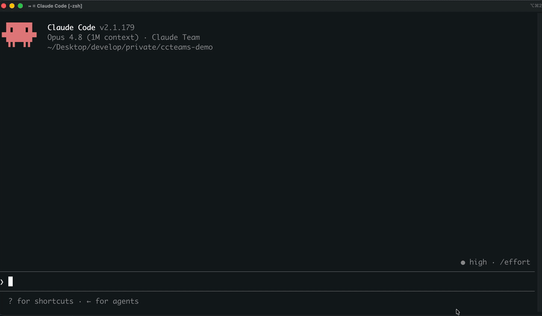

# ccteams — Agent-Team Package Manager for Claude Code

Apply a pre-built team of Claude Code subagents to your project with one command, and switch teams whenever the work changes. An **agent team** is a bundle of subagents (with specific roles, expertise, and behaviors) plus orchestration rules that control how they collaborate — managed as a single unit in your project's `.claude/` directory.

## Two ways to use it

Use ccteams from the terminal, from inside Claude Code, or both — whichever fits your flow.





```bash
ccteams list                 # see the teams
ccteams use <team>           # apply one (e.g. ccteams use go-api) to the current project
```

|                           | How you drive it        |                                                                                                                               |
| ------------------------- | ----------------------- | ----------------------------------------------------------------------------------------------------------------------------- |
| **CLI** (`ccteams`)       | From your terminal      | `ccteams list`, `ccteams use <team>`, `ccteams current`                                                                       |
| **Plugin** (`/ccteams:*`) | From inside Claude Code | `/ccteams:list-teams`, `/ccteams:use-team`, and `/ccteams:choose-team` — describe what you need and it picks the team for you |

The CLI is the engine, so it's always installed; the plugin adds the in-Claude-Code slash
commands (its skills call the CLI under the hood). Install one or both.

## Install

### 1. Install the CLI

```bash
npm install -g ccteams
ccteams list
```

Verify it prints the available teams. You can already use ccteams now — apply a team with
`ccteams use <team>` and restart Claude Code.

### 2. Add the Claude Code plugin

For slash commands inside Claude Code, add the marketplace and install the plugin:

```
/plugin marketplace add toffyui/ccteams
/plugin install ccteams@ccteams
/reload-plugins
```

Or restart Claude Code. The slash commands `/ccteams:list-teams`, `/ccteams:use-team`, and `/ccteams:choose-team` will then be available. (The plugin's skills call the `ccteams` CLI under the hood, so the CLI must be installed too.)

## Updating

```bash
# CLI (new commands, new bundled teams)
npm install -g ccteams@latest

# Plugin (new or changed slash commands)
/plugin marketplace update ccteams   # re-pull the latest from the repo
/reload-plugins                       # or restart Claude Code
```

A full uninstall/reinstall is **not** needed. New slash commands reach users when the
plugin's `version` is bumped (the plugin is versioned via `plugin.json`); a marketplace
update followed by `/reload-plugins` picks them up.

## Usage

### Command Line (CLI)

```bash
ccteams list                      # All teams (compact, one line each)
ccteams list --details            # Full descriptions and tags
ccteams list --json               # Machine-readable JSON
ccteams use <team>                # Apply a team to the current project
ccteams use <team> --agent-teams  # Apply it AND enable agent-teams mode (optional)
ccteams current                   # Show the currently active team
ccteams --version                 # Print the version
```

After `ccteams use`, **restart Claude Code** so the team loads (see below).

### Claude Code (slash commands — via the plugin)

```
/ccteams:list-teams                    # List available teams
/ccteams:use-team <team-name>          # Apply a team
/ccteams:choose-team <natural-language> # Find and apply a team by description ("for backend work", "frontend-focused", etc.)
```

## Available teams

ccteams ships with these teams out of the box. Each is a builder + reviewer pair (except `research`, which is a single read-only researcher), and every team bundles a **domain playbook skill** (`<team>-playbook`) — an operational distillation of frontier-model working discipline for that stack: an operating loop, a failure catalog (symptom → wrong instinct → correct move), discriminating checks, decision trees, a verification recipe, and a reviewer hunt list. Agents are instructed to read their playbook as their first action, and the team's orchestration rules gate reports against it.

| Team             | What it's for                                                                                                                                      |
| ---------------- | -------------------------------------------------------------------------------------------------------------------------------------------------- |
| `generalist`     | Stack-agnostic, end-to-end feature team: scope → design → build → QA → ship. Use when no stack-specific team fits or for general cross-stack work. |
| `next-ts`        | Next.js (App Router) + TypeScript + Tailwind — RSC, Server Actions, type-safe data fetching, accessible UI.                                        |
| `frontend`       | Framework-agnostic UI/UX and accessibility — UI work that isn't Next.js-specific, or focused on a11y/responsive/UX quality.                        |
| `sveltekit`      | SvelteKit 2 + Svelte 5 + TypeScript — reactive components, server-side rendering, form actions, and type-safe load functions.                     |
| `react-native`   | Expo + React Native (TypeScript) mobile apps — screens, navigation, data fetching, plus a native-decisions advisor (Expo/EAS/config plugins).      |
| `go-api`         | Go HTTP API backend — idiomatic services with `net/http` and `database/sql`.                                                                       |
| `python-fastapi` | Python FastAPI + Pydantic v2 — async HTTP APIs with full type coverage and validation.                                                             |
| `rails`          | Ruby on Rails — ActiveRecord, convention-over-configuration, the full Rails stack.                                                                 |
| `django`         | Django + Django REST Framework — ORM, migrations, class-based views, and DRF APIs. Fat models, thin views.                                          |
| `debug`          | Stack-agnostic bug hunting — reproduce → root-cause → minimal fix → regression test.                                                               |
| `research`       | Stack-agnostic technical research — compare options and produce a written recommendation. Writes no code.                                          |

Run `ccteams list` for the full descriptions and tags, or `/ccteams:choose-team <what you need>` to let Claude pick one for you.

## One team per session (and monorepos)

ccteams applies **one team per project at a time**. `ccteams use <team>` is an exclusive switch: applying a new team cleanly replaces the previous one.

This is partly a Claude Code constraint: subagents in `.claude/agents/` are **global to the project** and cannot be scoped to a subdirectory. You can't, for example, have the `next-ts` team active only in `apps/web/` and `go-api` only in `apps/api/` at the same time with isolation.

**Monorepo workaround:** pick the team that matches the area you're actively working on. Claude Code loads `CLAUDE.md` files along the path to the files you're editing, so launching `claude` from the subdirectory you're working in gives you that subtree's `CLAUDE.md` context — but the applied team's agents themselves remain available repo-wide.

## IMPORTANT: Session restart required

After running `ccteams use`, `/ccteams:use-team`, or `/ccteams:choose-team`, **you must restart Claude Code** for the new agent team to load. The agents are instantiated at session start, not mid-session.

**To restart:** type `/exit` (or close Claude Code) and start a new session.

## How teams are applied to your project

When you apply a team with `ccteams use <team>` or `/ccteams:use-team <team>`:

1. The team's agent definitions are copied into `.claude/agents/`.
2. The team's skills are copied into `.claude/skills/` — every team ships the shared `working-method` skill (see below), plus any team-specific skills it declares.
3. A user-owned `.claude/skills/team-lessons/SKILL.md` is scaffolded **once** if absent. This file is yours: ccteams never tracks, overwrites, or deletes it, so it survives team switches, re-applies, and package updates. (The name `team-lessons` is reserved — teams cannot ship a skill under it.)
4. A `.claude/active-team.md` file is created, documenting the active team and its purpose.
5. Your project's `.claude/CLAUDE.md` is updated with an import statement (`@.claude/active-team.md`) to include the team's orchestration rules.
6. A `.claude/.ccteams-manifest.json` is written to track which team is active and allow clean switching.
7. If you pass `--agent-teams` (or the team opts in via `"requiresAgentTeams": true`), `CLAUDE_CODE_EXPERIMENTAL_AGENT_TEAMS=1` is set in `.claude/settings.json`. This is optional — without it, the team runs in the normal orchestrated mode.

ccteams includes a **collision guard**: it will refuse to apply a team if any of its agents or skills share a filename with files you've written by hand in `.claude/agents/` or `.claude/skills/`. This prevents accidental overwrites.

## The working-method skill

Every team installs `.claude/skills/working-method/SKILL.md`: a distillation of frontier-model working discipline — goal compression, ground truth before opinion, hypothesis discipline, execution as evidence, honest reporting, and an exit checklist. It exists to close the gap between model tiers: most of what makes a top-tier model's output better is discipline and verification, which smaller models can follow as instructions.

It is delivered through two channels:

- **Always active:** every team's orchestration rules (in `.claude/active-team.md`, always in context) instruct the orchestrator to inject a 6-point working-method digest into every delegation prompt, so every subagent receives it regardless of model.
- **On demand:** the full skill file is available for the orchestrator or any agent to read when depth is needed.

Because ccteams places it, re-running `ccteams use` overwrites any local edits to the file (same semantics as `active-team.md`). To customize it permanently, copy the content to a differently-named skill.

## Team playbooks

On top of the shared working method, every team ships its own `<team>-playbook` skill (installed at `.claude/skills/<team>-playbook/SKILL.md`). Where the working method is stack-agnostic discipline, the playbook is the domain expertise: the exact reconnaissance order for that stack, the 10–15 mistakes mid-tier models actually make in it, the cheap experiments that settle its recurring uncertainties, and the exact commands that constitute verification. Delivery is three-layered so it reliably reaches subagents: each agent's system prompt starts with a "FIRST ACTION: read the playbook" directive plus inline non-negotiable minimums, the orchestration rules require every delegation prompt to open with the read-the-playbook instruction, and the full skill file is available on demand.

Playbooks are living documents: the working method's learning loop instructs the orchestrator to draft a new failure-catalog entry (symptom → wrong instinct → correct move) whenever a mistake surfaces that the playbook didn't predict, and to propose it to you. Accepted lessons have two homes, by scope:

- **Project-specific lessons** go into `.claude/skills/team-lessons/SKILL.md` — the user-owned file ccteams scaffolds once and never touches again. It survives team switches and package updates, and the orchestrator injects its entries into delegations alongside playbook rules. (Never put lessons in the playbook copies themselves — those are replaced on every `ccteams use`.)
- **Universal lessons** — true for the stack in any project — belong upstream: open a PR against the team's playbook in this repo, and every user's team gains the immunity on the next release.

## Per-agent model presets

Every bundled agent ships with a `model:` set in its frontmatter, assigned by how much reasoning the role needs:

- **`opus`** — planning, design, review, and research roles (scope-planner, architect, all `*-reviewer` agents, advisors, the researcher).
- **`sonnet`** — mechanical implementation roles (all `*-builder` agents and the shipper).

The lead session's own model isn't set by ccteams — pick it with `/model` in Claude Code. A common setup is a top-tier orchestrator (e.g. Fable 5) delegating to these Opus/Sonnet subagents, so the expensive model only plans and synthesizes while cheaper models do the work.

**Changing the presets.** The `model:` line is just agent frontmatter — edit any `.claude/agents/*.md` to repin (`opus`, `sonnet`, `haiku`, or a full model ID), or delete the line to have that agent inherit the session's model. If your plan doesn't include Opus, either repin the `opus` agents to a model you have or remove the line so they fall back to your session model.

## Committing `.claude/` — your choice

You have two options:

**Option A (shared teams):** Commit `.claude/agents/`, `.claude/active-team.md`, and `.claude/.ccteams-manifest.json` to git. Teammates pulling the repo will automatically have the same team active.

**Option B (local teams):** Add `.claude/agents/`, `.claude/active-team.md`, and `.claude/.ccteams-manifest.json` to `.gitignore`. Each developer can run `ccteams use` locally to activate their preferred team.

**Recommendation:** If your project benefits from consistent team composition (e.g., a shared code style or mandatory QA agents), commit the team. Otherwise, keep it local.

## Contributing a team

ccteams applies the teams bundled in this repo's `teams/` directory. To add a new team,
contribute it here (open a PR) — there's no separate user-local team registry. A team lives
in `teams/<name>/`:

```
teams/<name>/
├── team.json               # Metadata: name, description, tags, optional flags
├── orchestration.md        # The CLAUDE.md rules to import (defines roles, goals, behavior)
├── agents/
│   ├── agent1.md           # YAML frontmatter + agent system prompt
│   ├── agent2.md
│   └── ...
└── skills/                 # Optional: team-specific skills
    └── my-skill/
        └── SKILL.md
```

### `team.json` schema

```json
{
  "name": "my-team",
  "description": "A short pitch of what this team does",
  "tags": ["backend", "api", "performance"],
  "requiresAgentTeams": false,
  "skills": ["my-skill"]
}
```

Set `"requiresAgentTeams": true` if your team uses agent-to-agent messaging or collaborative member features.

`skills` is optional. Each name resolves first to the team's own `skills/<name>/`, then falls back to the repo-level `shared/skills/<name>/`. The shared `working-method` skill is placed for every team automatically — you never need to list it.

### Agent files (`.md`)

Each agent file is a standard Claude Code subagent: YAML frontmatter (`name`, `description`, and optional `tools`) followed by its system prompt:

```markdown
---
name: my-agent
description: Backend API specialist. Use for building and reviewing REST/GraphQL endpoints, data layers, and integrations.
tools: Read, Write, Edit, Bash, Glob, Grep
---

You are a Python backend expert. Your job is to...
```

The `description` is what Claude uses to decide when to delegate to this agent, so make it specific. Omit `tools` to inherit all available tools.

For examples to copy from, see `teams/next-ts/` (a stack-specific team) and `teams/debug/` (a stack-agnostic team). `next-ts/` is the cleanest reference for the builder + reviewer shape.

### Orchestrated vs. collaborative teams

All teams that ship today are **orchestrated**: one lead delegates to specialized subagents that report back independently. This is the simple, predictable default.

ccteams also supports **collaborative** teams — where subagents message each other directly — via Claude Code's experimental agent-teams feature (`CLAUDE_CODE_EXPERIMENTAL_AGENT_TEAMS=1`). ccteams writes that env key into `.claude/settings.json` for you in two cases:

- The team declares `"requiresAgentTeams": true` in its `team.json` — agent-teams mode is enabled automatically whenever you apply it.
- You pass the `--agent-teams` flag to `ccteams use`, which opts any team into agent-teams mode for that project:

  ```bash
  ccteams use <team> --agent-teams
  ```

  The flag is position-agnostic, so `ccteams use --agent-teams <team>` works too.

When ccteams added the env key (either way), it removes it again the next time you switch to a team that doesn't need it. No collaborative team ships by default, but the format supports authoring one.

## Development / local testing

### Test the plugin locally (session-only)

```bash
claude --plugin-dir ./plugins/ccteams
```

This loads the plugin for the current session only — no permanent install. Useful for development.

### Test the CLI locally

```bash
npm install -g .
ccteams list
```

Installs the CLI from the repo's current source.

## License

MIT © toffyui. See [LICENSE](./LICENSE) for the full text.

## Orynth

I would be grateful if you can vote here!

<a href="https://orynth.dev/projects/ccteams" target="_blank" rel="noopener">
  
</a>
