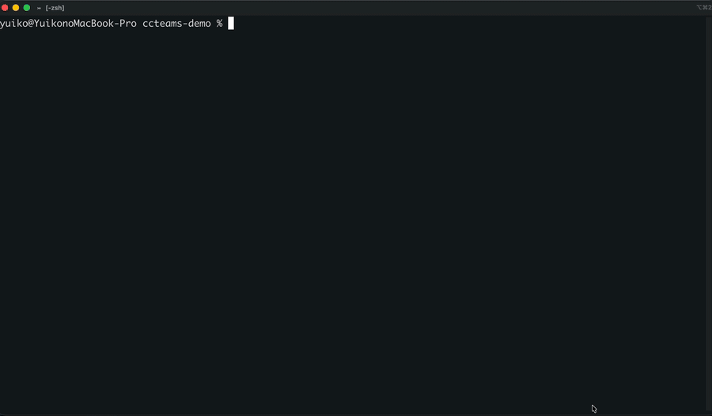
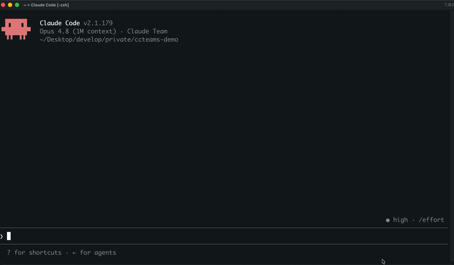

# ccteams — Agent-Team Package Manager for Claude Code

Apply a pre-built team of Claude Code subagents to your project with one command, and stack or remove teams whenever the work changes. An **agent team** is a bundle of subagents (with specific roles, expertise, and behaviors) plus orchestration rules that control how they collaborate — managed as a single unit in your project's `.claude/` directory. Applying a team is **additive**: you can have more than one team applied to the same project at once (e.g. a stack-specific team plus `frontend`), and `ccteams unuse <team>` removes one without disturbing the others.

## Two ways to use it

Use ccteams from the terminal, from inside Claude Code, or both — whichever fits your flow.





```bash
ccteams list                 # see the teams
ccteams use <team>           # apply one (e.g. ccteams use go-api) to the current project — additive
ccteams unuse <team>         # remove one applied team, leaving any others in place
```

|                           | How you drive it        |                                                                                                                                                     |
| ------------------------- | ----------------------- | ----------------------------------------------------------------------------------------------------------------------------------------------------|
| **CLI** (`ccteams`)       | From your terminal      | `ccteams list`, `ccteams use <team>`, `ccteams unuse <team>`, `ccteams current`                                                                     |
| **Plugin** (`/ccteams:*`) | From inside Claude Code | `/ccteams:list-teams`, `/ccteams:use-team`, `/ccteams:unuse-team`, and `/ccteams:choose-team` — describe what you need and it picks the team for you |

The CLI is the engine, so it's always installed; the plugin adds the in-Claude-Code slash
commands (its skills call the CLI under the hood). Install one or both.

## Install

### 1. Install the CLI

> [!IMPORTANT]
> The install steps here differ from the `ccteams` package on the npm registry: that package
> is the upstream one and does not include this fork's changes (manifest v4, `ccteams migrate`, and
> more). Install from this repository's Git URL as shown below — **not** `npm install -g ccteams`,
> which installs the unrelated upstream package instead. `ccteams upgrade` is safe to run: it
> reinstalls from this fork's Git URL, so it always stays on this fork.

```bash
npm install -g https://github.com/rinjugatla/ccteams.git
ccteams list
```

No clone is needed — npm installs straight from the Git URL. (Contributors working on
ccteams itself can clone and `npm install -g .` instead; see
[Development / local testing](#development--local-testing).)

Verify it prints the available teams. You can already use ccteams now — apply a team with
`ccteams use <team>` and restart Claude Code.

### 2. Add the Claude Code plugin

For slash commands inside Claude Code, add the marketplace and install the plugin:

```
/plugin marketplace add rinjugatla/ccteams
/plugin install ccteams@ccteams
/reload-plugins
```

Or restart Claude Code. The slash commands `/ccteams:list-teams`, `/ccteams:use-team`, `/ccteams:unuse-team`, and `/ccteams:choose-team` will then be available. (The plugin's skills call the `ccteams` CLI under the hood, so the CLI must be installed too.)

## Updating

```bash
# CLI (new commands, new bundled teams) — same Git-URL install as above
npm install -g https://github.com/rinjugatla/ccteams.git
# ...or equivalently: ccteams upgrade

# Plugin (new or changed slash commands)
/plugin marketplace update ccteams   # re-pull the latest from the repo
/reload-plugins                       # or restart Claude Code
```

Don't update with `npm install -g ccteams@latest` — that pulls the upstream npm package and
replaces this fork's CLI (see the note under [Install](#install)). `ccteams upgrade` is
equivalent to the Git-URL install above and is safe to use.

A full uninstall/reinstall is **not** needed. New slash commands reach users when the
plugin's `version` is bumped (the plugin is versioned via `plugin.json`); a marketplace
update followed by `/reload-plugins` picks them up.

Updating the package does **not** by itself change anything already placed in your
project's `.claude/` — `ccteams use`, `ccteams unuse`, and `ccteams migrate` are the only
commands that write there, and they only run when you run them. If a newer ccteams ships new files inside a
directory it already scaffolded into your project (e.g. `.claude/skills/team-lessons/`), run
`ccteams migrate` to pick them up — see [Keeping a project up to date](#keeping-a-project-up-to-date-ccteams-migrate) below.

## Usage

### Command Line (CLI)

```bash
ccteams list                      # All teams (compact, one line each)
ccteams list --details            # Full descriptions and tags
ccteams list --json               # Machine-readable JSON
ccteams use <team>                # Apply (stack) a team onto the current project — additive
ccteams use <team> --agent-teams  # Apply it AND enable agent-teams mode (optional)
ccteams unuse <team>              # Remove one applied team, leaving any others in place
ccteams current                   # Show all currently-applied teams
ccteams migrate                   # Add/update files a newer ccteams ships; report an out-of-date SKILL.md
ccteams migrate --dry-run         # Preview only — writes nothing; exits 1 if work is pending
ccteams migrate --yes             # Skip confirmation; still leaves files you edited untouched
ccteams migrate --yes --force     # Also overwrite files you edited (or with an unknown baseline)
ccteams --version                 # Print the version
```

After `ccteams use` or `ccteams unuse`, **restart Claude Code** so the change loads (see below).

### Claude Code (slash commands — via the plugin)

```
/ccteams:list-teams                    # List available teams
/ccteams:use-team <team-name>          # Apply (stack) a team
/ccteams:unuse-team <team-name>        # Remove one applied team
/ccteams:choose-team <natural-language> # Find and apply a team by description ("for backend work", "frontend-focused", etc.)
```

## Available teams

ccteams ships with these teams out of the box. Each is a builder + reviewer pair (except `research`, which is a single read-only researcher), and every team bundles a **domain playbook skill** (`<team>-playbook`) — an operational distillation of frontier-model working discipline for that stack: an operating loop, a failure catalog (symptom → wrong instinct → correct move), discriminating checks, decision trees, a verification recipe, and a reviewer hunt list. Agents are instructed to read their playbook as their first action, and the team's orchestration rules gate reports against it.

| Team             | What it's for                                                                                                                                      |
| ---------------- | -------------------------------------------------------------------------------------------------------------------------------------------------- |
| `generalist`     | Stack-agnostic, end-to-end feature team: scope → design → build → QA → ship. Use when no stack-specific team fits or for general cross-stack work. |
| `next-ts`        | Next.js (App Router) + TypeScript + Tailwind — RSC, Server Actions, type-safe data fetching, accessible UI.                                        |
| `frontend`       | Framework-agnostic UI/UX and accessibility — UI work that isn't Next.js-specific, or focused on a11y/responsive/UX quality.                        |
| `sveltekit`      | SvelteKit 2 + Svelte 5 + TypeScript — reactive components, server-side rendering, form actions, and type-safe load functions.                     |
| `react-native`   | Expo + React Native (TypeScript) mobile apps — screens, navigation, data fetching, plus a native-decisions advisor (Expo/EAS/config plugins).      |
| `go-api`         | Go HTTP API backend — idiomatic services with `net/http` and `database/sql`.                                                                       |
| `python-fastapi` | Python FastAPI + Pydantic v2 — async HTTP APIs with full type coverage and validation.                                                             |
| `rails`          | Ruby on Rails — ActiveRecord, convention-over-configuration, the full Rails stack.                                                                 |
| `django`         | Django + Django REST Framework — ORM, migrations, class-based views, and DRF APIs. Fat models, thin views.                                          |
| `debug`          | Stack-agnostic bug hunting — reproduce → root-cause → minimal fix → regression test.                                                               |
| `research`       | Stack-agnostic technical research — compare options and produce a written recommendation. Writes no code.                                          |

Run `ccteams list` for the full descriptions and tags, or `/ccteams:choose-team <what you need>` to let Claude pick one for you.

## Multiple teams per project (and monorepos)

`ccteams use <team>` is **additive**: applying a team stacks it alongside any team(s) already applied, instead of replacing them. The **first** team you ever apply to a project is the **primary team** — its orchestration rules govern the project and its lead acts as the single orchestrator. Every other applied team is a **support team**: its agents are additional specialists available for delegation. Run `ccteams unuse <team>` to remove one team without disturbing the others; if you remove the primary team, the next-applied team is promoted to primary. `ccteams current` shows every applied team in order, with the primary marked.

A common pattern: apply a stack-specific team (e.g. `go-api`) as primary, then additionally apply `frontend` for UI work in the same project, without losing either team's agents.

Note that subagents in `.claude/agents/` are **global to the project** and cannot be scoped to a subdirectory. You can't, for example, have the `next-ts` team active only in `apps/web/` and `go-api` only in `apps/api/` at the same time with isolation.

**Monorepo workaround:** apply the teams that match the areas you're actively working on. Claude Code loads `CLAUDE.md` files along the path to the files you're editing, so launching `claude` from the subdirectory you're working in gives you that subtree's `CLAUDE.md` context — but every applied team's agents remain available repo-wide.

## IMPORTANT: Session restart required

After running `ccteams use`, `ccteams unuse`, `/ccteams:use-team`, `/ccteams:unuse-team`, or `/ccteams:choose-team`, **you must restart Claude Code** for the change to load. Agents are instantiated at session start, not mid-session.

**To restart:** type `/exit` (or close Claude Code) and start a new session.

## How teams are applied to your project

When you apply a team with `ccteams use <team>` or `/ccteams:use-team <team>`:

1. The team's agent definitions are copied into `.claude/agents/`.
2. The team's skills are copied into `.claude/skills/` — every team ships the shared `working-method` skill (see below), plus any team-specific skills it declares.
3. A user-owned `.claude/skills/team-lessons/` skill is scaffolded (`SKILL.md`, `AUTHORING.md`, `scripts/gen-lessons.mjs`, `scripts/lessons-index.mjs`, `lessons/.gitkeep`). Each file is written **only if absent**: everything already there is yours, and ccteams never tracks, overwrites, or deletes it, so it survives team applies, removals, re-applies, and package updates. (The name `team-lessons` is reserved — teams cannot ship a skill under it.) See [The team-lessons skill](#the-team-lessons-skill).
4. The team's orchestration rules are copied to `.claude/ccteams/<team-name>.md`.
5. A generated composite `.claude/active-team.md` is (re)written, listing every currently-applied team in application order (first = primary) and importing each team's `.claude/ccteams/<team-name>.md`.
6. Your project's `.claude/CLAUDE.md` is updated with a single import statement (`@.claude/active-team.md`) if not already present — it never changes even as teams are added or removed.
7. A `.claude/.ccteams-manifest.json` is written to track which teams are applied, in what order, and which files each one placed, so a team can be cleanly removed later without touching another applied team's files. Every tracked path is confined to your project: an entry that would resolve outside the project root is skipped when the manifest is written, and ignored by every operation that acts on files — including `ccteams unuse`, which deletes what the manifest lists. So no manifest entry, however corrupted or hand-edited, can name a path outside the project for those operations to act on. Two limits worth stating plainly: this checks the path itself, not what it ultimately points at (a symlink stored under `.claude/` counts as inside), and purely informational output such as the file count in `ccteams current` reports the manifest as stored. The skip on write is deliberately silent, because `ccteams migrate` writes the manifest only on a real run — warning there would make the real run say something its `--dry-run` preview structurally could not.
8. If you pass `--agent-teams` (or the team opts in via `"requiresAgentTeams": true`), `CLAUDE_CODE_EXPERIMENTAL_AGENT_TEAMS=1` is set in `.claude/settings.json`. This stays set as long as any applied team still needs it, and is removed automatically once no applied team does.

Running `ccteams use <team>` again for a team that's already applied **re-applies** it in place (refreshes its files) without changing its position or primary status.

`ccteams unuse <team>` removes one applied team: its files are deleted, **except** any file also claimed by another still-applied team (e.g. the shared `working-method` skill survives as long as at least one applied team needs it). `.claude/active-team.md` is regenerated for the remaining teams. When the last team is removed, ccteams also deletes `.claude/active-team.md`, removes the `@.claude/active-team.md` import line from `CLAUDE.md`, and deletes the manifest — `team-lessons` and any `.claude/settings.json` keys ccteams didn't write are never touched.

ccteams includes a **collision guard**: it will refuse to apply a team if any of its agents or skills share a filename with a file that exists on disk but wasn't placed by any currently-applied ccteams team (i.e. you wrote it by hand). This prevents accidental overwrites; files owned by another applied ccteams team are safe to share.

## The working-method skill

Every team installs `.claude/skills/working-method/SKILL.md`: a distillation of frontier-model working discipline — goal compression, ground truth before opinion, hypothesis discipline, execution as evidence, honest reporting, and an exit checklist. It exists to close the gap between model tiers: most of what makes a top-tier model's output better is discipline and verification, which smaller models can follow as instructions.

It is delivered through two channels:

- **Always active:** every team's orchestration rules (imported into `.claude/active-team.md`, always in context) instruct the orchestrator to inject a 6-point working-method digest into every delegation prompt, so every subagent receives it regardless of model.
- **On demand:** the full skill file is available for the orchestrator or any agent to read when depth is needed.

Because ccteams places it, re-running `ccteams use` for a team that ships it overwrites any local edits to the file. It is only deleted once no applied team claims it anymore (see `ccteams unuse` above). To customize it permanently, copy the content to a differently-named skill.

## Team playbooks

On top of the shared working method, every team ships its own `<team>-playbook` skill (installed at `.claude/skills/<team>-playbook/SKILL.md`). Where the working method is stack-agnostic discipline, the playbook is the domain expertise: the exact reconnaissance order for that stack, the 10–15 mistakes mid-tier models actually make in it, the cheap experiments that settle its recurring uncertainties, and the exact commands that constitute verification. Delivery is three-layered so it reliably reaches subagents: each agent's system prompt starts with a "FIRST ACTION: read the playbook" directive plus inline non-negotiable minimums, the orchestration rules require every delegation prompt to open with the read-the-playbook instruction, and the full skill file is available on demand.

Playbooks are living documents: the working method's learning loop instructs the orchestrator to draft a new failure-catalog entry (symptom → wrong instinct → correct move) whenever a mistake surfaces that the playbook didn't predict, and to propose it to you. Accepted lessons have two homes, by scope:

- **Project-specific lessons** go into the `.claude/skills/team-lessons/` skill — user-owned, scaffolded once and never touched again. It survives applying, removing, and re-applying teams, and package updates, and the orchestrator injects its entries into delegations alongside playbook rules. (Never put lessons in the playbook copies themselves — those are replaced on every `ccteams use`.)
- **Universal lessons** — true for the stack in any project — belong upstream: open a PR against the team's playbook in this repo, and every user's team gains the immunity on the next release.

## The team-lessons skill

`.claude/skills/team-lessons/` is where the learning loop's accepted entries land. It is scaffolded as five files:

```
.claude/skills/team-lessons/
├── SKILL.md                     # generated index — one short entry per lesson
├── AUTHORING.md                 # frontmatter schema + how to add an entry (read only when writing)
├── lessons/                     # one lesson per file: NN-slug.md
└── scripts/
    ├── gen-lessons.mjs          # builds the index from the lessons' frontmatter
    └── lessons-index.mjs        # prints the index for a Claude Code hook (see below)
```

**Why it is split.** A single-file catalog grows without bound, and the whole file is loaded into context every time the catalog is consulted — so an old lesson nobody needs today still costs tokens on every task. Splitting it caps the always-loaded cost at a few lines per lesson (`applies_when → symptom → correct move`, linked to the detail file), and keeps `AUTHORING.md` out of the read path entirely: it is read when writing a lesson, not when applying one.

**Why the index is generated.** A hand-written index drifts the moment a lesson is added, renumbered, or reworded, and a stale index sends agents to the wrong lesson — or hides one. `scripts/gen-lessons.mjs` derives the index from each lesson's own frontmatter (`applies_when` / `symptom` / `summary`), so there is nothing to keep in sync by hand:

```bash
# regenerate the index (run after adding or editing a lesson, commit the result)
node .claude/skills/team-lessons/scripts/gen-lessons.mjs

# verify the committed index still matches lessons/ — exits 1 on drift, wire into CI
node .claude/skills/team-lessons/scripts/gen-lessons.mjs --check
```

The index is committed rather than built on demand, because agents read the repo, not a build output. `--check` is what keeps a committed generated file honest — it also catches a hand-edit between the `<!-- team-lessons:catalog:* -->` markers. The script is plain Node ESM with zero dependencies, so it works in any project with Node installed, whatever its language or package manager.

**Injecting the catalog via a hook.** Consulting the catalog only happens if an agent decides to open `SKILL.md`. `scripts/lessons-index.mjs` prints the catalog body to stdout (nothing if there are zero lessons yet), so wiring it into a Claude Code hook gets it into every session's and every subagent's context unconditionally, in `.claude/settings.json`:

```json
{
  "hooks": {
    "SessionStart": [
      {
        "matcher": "",
        "hooks": [
          {
            "type": "command",
            "command": "node .claude/skills/team-lessons/scripts/lessons-index.mjs"
          }
        ]
      }
    ],
    "SubagentStart": [
      {
        "matcher": "",
        "hooks": [
          {
            "type": "command",
            "command": "node .claude/skills/team-lessons/scripts/lessons-index.mjs"
          }
        ]
      }
    ]
  }
}
```

Both `SessionStart` and `SubagentStart` are needed: `SessionStart` only fires for the main session, not for subagents, and subagents are the ones that most need the catalog (they run the actual work and can't be relied on to open `SKILL.md` on their own) — so `SessionStart` alone falls short of the goal. ccteams does not write this registration for you: hooks let a project run an arbitrary command on every session, and the same contract that keeps ccteams from touching any `.claude/settings.json` key it didn't write applies here, so adding it is a deliberate, explicit step you take yourself.

**Lessons are written in the project's own language** — the one its README uses — so the catalog reads like the rest of the repo instead of like a foreign appendix. Frontmatter keys and filename slugs stay ASCII regardless. The scaffolded `AUTHORING.md` states the rule where lesson authors will actually see it.

**Upgrading from the older single-file layout.** If your `SKILL.md` predates this and holds its lessons inline, `ccteams use` leaves it exactly as it is, adds only the missing pieces (`AUTHORING.md`, `lessons/`, `scripts/`), and prints a note. The migration steps are in the scaffolded `AUTHORING.md`.

## Keeping a project up to date (`ccteams migrate`)

Reinstalling the CLI (`npm install -g https://github.com/rinjugatla/ccteams.git`, see [Install](#install)) upgrades the globally installed CLI, but it does **not** touch files ccteams already placed in your project — those only change when you run `ccteams use`, `ccteams unuse`, or `ccteams migrate`. `ccteams migrate` closes that gap for what it is safe for ccteams to add or update on its own:

```bash
ccteams migrate                # add missing files, update files ccteams itself has since changed, report drift only you can resolve
ccteams migrate --dry-run      # preview only — writes nothing; exits 1 if ccteams would add/update anything without asking
ccteams migrate --yes          # skip the interactive confirmation; still leaves files you edited untouched
ccteams migrate --yes --force  # also overwrite files you edited (or whose baseline is unknown), without asking
```

- **What it does today:** four things, layered so nothing that could lose your work happens without your say-so.
  1. It **adds** any file missing from the scaffolded `.claude/skills/team-lessons/` skill (see above) — the same never-overwrite scaffold `ccteams use` runs, so a project that only ran `ccteams use` a while ago can pick up files a newer ccteams added to that skill (e.g. a new script) without re-applying a team.
  2. It **reports** an existing `.claude/skills/team-lessons/SKILL.md` whose catalog index is in an older layout — either lacking a usable marker pair (absent, or the end marker first), or with the generated note still between the markers. That file is yours: ccteams prints the command to run (`gen-lessons.mjs`, plus the markers to add first when they are absent) and never rewrites the file itself.
  3. It **reports** whether the catalog-injection hook (see [The team-lessons skill](#the-team-lessons-skill) above, "Injecting the catalog via a hook") is registered in `.claude/settings.json` for `SessionStart` and `SubagentStart` — checked and reported individually, since registering only one still leaves a gap. Hooks run an arbitrary command on every session, so ccteams never writes this registration for you: when something is missing, it prints a copy-pasteable JSON fragment for the missing event(s) instead. Once both are registered, `ccteams migrate` reports nothing further about them.
  4. It **reconciles ccteams-owned files** — agent definitions (`.claude/agents/*.md`), every team's playbook skill (`.claude/skills/<team>-playbook/`), and the shared `.claude/skills/working-method/` skill — against what the currently installed ccteams package would place there today. Each file is classified by comparing three things: the package's current source, the project's current content, and the hash ccteams recorded as the baseline when it placed the file:
     - **Unchanged** (your copy still matches the package): nothing to do, nothing reported.
     - **Upstream-changed** (your copy still matches the recorded baseline; only the package's own file moved on): updated automatically, no confirmation needed — you never touched it.
     - **User-modified** (your copy no longer matches the recorded baseline): left alone by default. Overwrite it with `ccteams migrate --yes --force`, or answer the interactive prompt (`[y] overwrite [n] keep mine [d] show diff [a] overwrite all [q] quit`) when running in a terminal.
     - **Unknown baseline** (no baseline hash was ever recorded for it — e.g. the project's manifest predates this feature): same default (left alone), but ccteams is explicit that it cannot tell your edit from an upstream update, since no baseline was ever recorded to compare against.
     A file the manifest still lists but the package can no longer find a source for (a renamed/removed team, for instance) is left untouched and reported, never deleted. The user-owned `.claude/skills/team-lessons/` skill is **never** part of this — see [The team-lessons skill](#the-team-lessons-skill).
- **`--yes` vs. `--force`:** `--yes` alone skips the confirmation prompt but still only auto-applies upstream-changed files — it deliberately never overwrites a user-modified or unknown-baseline file, so an unattended CI run can never silently discard your edits. `--force` only takes effect together with `--yes` (running it alone is rejected with an error) and is what additionally authorizes overwriting those files too.
- **Non-interactive environments (CI, piped stdin) are never prompted.** Without `--yes`, a user-modified/unknown-baseline file is simply left alone and reported — `ccteams migrate` never blocks waiting for input it cannot get.
- **Nothing is ever deleted**, and the user-owned `.claude/skills/team-lessons/` skill is never rewritten, overwritten, or deleted by `ccteams migrate` under any flag combination.
- **`--dry-run` writes nothing** and lists what would be added/updated. It exits `1` when ccteams would add or update a file WITHOUT asking (a missing or upstream-changed file) and `0` otherwise (so it composes with CI drift-checks the same way `gen-lessons.mjs --check` does — see above). **Notices, and files skipped pending your decision, do not affect the exit code:** a report that ends in a note about your `SKILL.md`, or about a user-modified file it left alone, still exits `0` — read the summary line, not just the exit code.
- **Run it from the project's main checkout, not a worktree.** ccteams writes into `.claude/`, and a git worktree's `.claude/` is typically untracked local state that gets discarded when the worktree is removed — running `migrate` there would not persist the change back to the repo.
- If ccteams is not applied in the current project (no `.claude/.ccteams-manifest.json`), `ccteams migrate` does nothing and exits `0`, pointing you at `ccteams use <team>` instead.
- **Manifest v4 and older ccteams versions:** the reconciliation above needs a per-file baseline hash, so the manifest format moved to v4 (`.claude/.ccteams-manifest.json`'s `"version": "4"`). This is written automatically the next time you run `ccteams use` or `ccteams migrate`. A project whose manifest is still v3 or earlier works fine with the current ccteams (it degrades to the "unknown baseline" case above until its baseline hashes are recorded), but the reverse does not hold: a pre-v4 ccteams CLI cannot read a v4 manifest, treats the project as if no team were applied, and then aborts on `ccteams use`, before writing anything, because the collision guard sees every ccteams-placed file as unexpectedly "hand-written". If your team pins a ccteams version, upgrade everyone together rather than leaving some machines on a pre-v4 CLI against a v4-manifest project.
- **Keep one ccteams version per machine:** don't switch back and forth between an old and a new `ccteams` binary — install it globally once, so a project's manifest and the CLI reading it never disagree. As of this writing, the `ccteams` package published to npm does not include v4 support and cannot read a v4 manifest; a v4-aware CLI comes from this repository (`npm install -g https://github.com/rinjugatla/ccteams.git`, see [Install](#install) — contributors working from a clone can use `npm install -g .` instead). If you encounter the abort described above, upgrade the CLI — the manifest is never downgraded to suit an older CLI.

## Per-agent model presets

Every bundled agent ships with a `model:` set in its frontmatter, assigned by how much reasoning the role needs:

- **`opus`** — planning, design, review, and research roles (scope-planner, architect, all `*-reviewer` agents, advisors, the researcher).
- **`sonnet`** — mechanical implementation roles (all `*-builder` agents and the shipper).

The lead session's own model isn't set by ccteams — pick it with `/model` in Claude Code. A common setup is a top-tier orchestrator (e.g. Fable 5) delegating to these Opus/Sonnet subagents, so the expensive model only plans and synthesizes while cheaper models do the work.

**Changing the presets.** The `model:` line is just agent frontmatter — edit any `.claude/agents/*.md` to repin (`opus`, `sonnet`, `haiku`, or a full model ID), or delete the line to have that agent inherit the session's model. If your plan doesn't include Opus, either repin the `opus` agents to a model you have or remove the line so they fall back to your session model.

## Committing `.claude/` — your choice

You have two options:

**Option A (shared teams):** Commit `.claude/agents/`, `.claude/ccteams/`, `.claude/active-team.md`, and `.claude/.ccteams-manifest.json` to git. Teammates pulling the repo will automatically have the same team(s) applied.

**Option B (local teams):** Add `.claude/agents/`, `.claude/ccteams/`, `.claude/active-team.md`, and `.claude/.ccteams-manifest.json` to `.gitignore`. Each developer can run `ccteams use` locally to apply their preferred team(s).

**Recommendation:** If your project benefits from consistent team composition (e.g., a shared code style or mandatory QA agents), commit the team(s). Otherwise, keep it local.

## Contributing a team

ccteams applies the teams bundled in this repo's `teams/` directory. To add a new team,
contribute it here (open a PR) — there's no separate user-local team registry. A team lives
in `teams/<name>/`:

```
teams/<name>/
├── team.json               # Metadata: name, description, tags, optional flags
├── orchestration.md        # The CLAUDE.md rules to import (defines roles, goals, behavior)
├── agents/
│   ├── agent1.md           # YAML frontmatter + agent system prompt
│   ├── agent2.md
│   └── ...
└── skills/                 # Optional: team-specific skills
    └── my-skill/
        └── SKILL.md
```

### `team.json` schema

```json
{
  "name": "my-team",
  "description": "A short pitch of what this team does",
  "tags": ["backend", "api", "performance"],
  "requiresAgentTeams": false,
  "skills": ["my-skill"]
}
```

Set `"requiresAgentTeams": true` if your team uses agent-to-agent messaging or collaborative member features.

`skills` is optional. Each name resolves first to the team's own `skills/<name>/`, then falls back to the repo-level `shared/skills/<name>/`. The shared `working-method` skill is placed for every team automatically — you never need to list it.

### Agent files (`.md`)

Each agent file is a standard Claude Code subagent: YAML frontmatter (`name`, `description`, and optional `tools`) followed by its system prompt:

```markdown
---
name: my-agent
description: Backend API specialist. Use for building and reviewing REST/GraphQL endpoints, data layers, and integrations.
tools: Read, Write, Edit, Bash, Glob, Grep, Skill
---

You are a Python backend expert. Your job is to...
```

The `description` is what Claude uses to decide when to delegate to this agent, so make it specific. When you list `tools` explicitly, include `Skill` so the agent is shown the skills available to it and can invoke them autonomously when the situation calls for it. Omit `tools` entirely to inherit all available tools.

For examples to copy from, see `teams/next-ts/` (a stack-specific team) and `teams/debug/` (a stack-agnostic team). `next-ts/` is the cleanest reference for the builder + reviewer shape.

### Orchestrated vs. collaborative teams

All teams that ship today are **orchestrated**: one lead delegates to specialized subagents that report back independently. This is the simple, predictable default.

ccteams also supports **collaborative** teams — where subagents message each other directly — via Claude Code's experimental agent-teams feature (`CLAUDE_CODE_EXPERIMENTAL_AGENT_TEAMS=1`). ccteams writes that env key into `.claude/settings.json` for you in two cases:

- The team declares `"requiresAgentTeams": true` in its `team.json` — agent-teams mode is enabled automatically whenever you apply it.
- You pass the `--agent-teams` flag to `ccteams use`, which opts any team into agent-teams mode for that project:

  ```bash
  ccteams use <team> --agent-teams
  ```

  The flag is position-agnostic, so `ccteams use --agent-teams <team>` works too.

When ccteams added the env key (either way), it removes it again once no applied team needs it anymore — either because you ran `ccteams unuse` on the team that needed it, or because every remaining applied team runs in the normal orchestrated mode. No collaborative team ships by default, but the format supports authoring one.

## Development / local testing

### Test the plugin locally (session-only)

```bash
claude --plugin-dir ./plugins/ccteams
```

This loads the plugin for the current session only — no permanent install. Useful for development.

### Test the CLI locally

```bash
npm install -g .
ccteams list
```

Installs the CLI from the repo's current source.

### Run the test suite

```bash
npm test
```

Runs the test files `package.json`'s `test` script enumerates, via `node --test`. That list is explicit rather than a glob, so a new test file does nothing until you add it there too. No dependencies to install — the suite uses only `node:test` and `node:assert`, matching the package's zero-dependency policy. It covers the team-lessons index generator, the hook script that extracts the catalog for injection, the never-overwrite contract of the team-lessons scaffold, the manifest's v4 schema (and its normalization of v1–v3), the `placedFiles` src→dest resolution used by both `ccteams use` and `ccteams migrate`, and `ccteams migrate` / `ccteams migrate --dry-run` — including its CLI integration, the team-lessons scaffold/hook-detection behavior it shares with `ccteams use`, and (in `test/migrate-owned-files.test.mjs`) the ccteams-owned-file reconciliation: the unchanged/upstream-changed/user-modified/unknown-baseline classification, `--yes`/`--force` gating, the interactive prompt flow (`y`/`n`/`a`/`q`/invalid input/EOF), non-TTY safety, baseline-hash bookkeeping, and the structural exclusion of the user-owned `team-lessons` skill.

## License

MIT © toffyui, rinjugatla. See [LICENSE](./LICENSE) for the full text.

## Orynth

I would be grateful if you can vote here!

<a href="https://orynth.dev/projects/rinjugatla-ccteams" target="_blank" rel="noopener">
  
</a>
